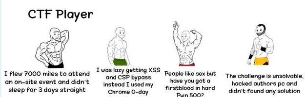

## What is Info-Sec?
Information Security is not only about securing information from unauthorised access. Information Security is basically the practice of preventing unauthorised access, use, disclosure, disruption, modification, inspection, recording or destruction of information. Information can be physical or electronic. Information can be anything like your details or we can say your profile on social media, your data in mobile phone, your biometrics etc. Thus Information Security spans so many research areas like Cryptography, Mobile Computing, Cyber Forensics, Online Social Media etc.

## Why learn Information Security?
Information system means to consider available countermeasures or controls stimulated through uncovered vulnerabilities and identify an area where more work is needed. The need for Information security:

* Protecting the functionality of the organisation
* Enabling the safe operation of applications
* Protecting the data that the organisation collect and use
* Safeguarding technology assets in organisations

## What are CTFs ?
CTFs (Capture the Flags) are infosec events where there are multiple infosec challenges related to various domains like rev , pwn , crypto , OSINT, forensics etc. are made available to participants where , which upon solving they find a text hidden by the problem maker called a flag. It’s not a country’s flag (xD) . These events can be held both online and on-site. Some of the famous CTFs are Insomni’hack, GoogleCTF, PlaidCTF, TCTF.

A typical CTF flag would look something like : **pclub{CTFs_ar3_fun!}**

A very good video that will help in understanding the deep relation between infosec and CTFs is probably this [Infosec Intro](https://www.youtube.com/watch?v=8ev9ZX9J45A). A great website to keep a look on old, ongoing and upcoming CTFs is [ctftime.org](http://ctftime.org/). Do bookmark it !

A nice video to get even more motivated towards this domain is probably the [Mr. Robot TV Series](https://www.youtube.com/watch?v=6MrQ-mN8HM8) (ignore the Dark Army part xD).

Do not worry if you don’t understand the technical terms in the meme above right now, you will surely understand most of it after completing this roadmap !

## Cyber Security
Cyber Security doesn’t refer to exploiting systems rather as the name suggests it is taking measures against them.

Understand cyber-security and domains under it:

https://www.kaspersky.co.in/resource-center/definitions/what-is-cyber-security

https://www.ibm.com/in-en/topics/cybersecurity

Some important resources and communities you will find in your cyber security journey -

- https://www.hackthebox.com/
- https://null-byte.wonderhowto.com/
- https://tryhackme.com

> Do give this a watch: [The MOST IMPORTANT advice for young hackers](https://youtu.be/0Ejj2aBG5c8?si=K-IHCKf1qxxl4qCJ)

Source: [Infosec Roadmap | PClub](https://pclub.in/roadmap/2024/06/06/infosec-roadmap/)

